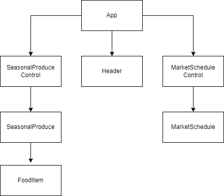
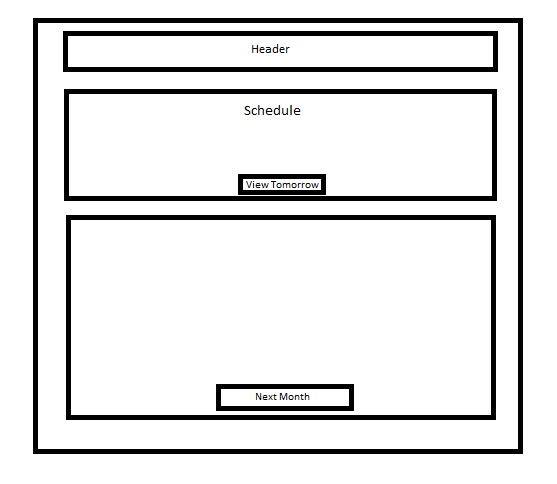

# _Farmers Market_

#### By _**Jacob Wilson, Liz Thomas**_

#### _A project for practicing class components in React._

## Technologies Used

* _HTML_
* _JavaScript_
* _CSS_
* _Markdown_
* _Bootstrap_
* _React_

## Description

_A project for practicing class components in React. Systems are separated into multiple components and rendered dynamically. View Diagram below for react inheritance_

## Setup/Installation Requirements

* _You can find the github repository [here](https://github.com/JLEWilson/Farmers-Market.git)_
* _Click the code button, and copy the https link_
* _In your in git bash or your preferred git terminal navigate to the directory you would like to store the project_
* _Enter: "git clone" followed by the https link_
* _Now that the repository is cloned to your computer, right click on the folder and click open with vs code_
* _Now type npm install in your terminal to install the packages used in the project, you may have to run install twice due to the size of the packages_
* _You can now view the project by typing npm run start in your terminal_

## Known Bugs

* _No known bugs_

## License - [MIT](https://opensource.org/licenses/MIT)

_If you run into any problems or find a bug, would like to reach me for a separate reason, feel free to send me an email @jacobleeeugenewilson@gmail.com with details of your issue._

Copyright (c) _02/08/2022_ _Jacob Wilson, Liz Thomas_